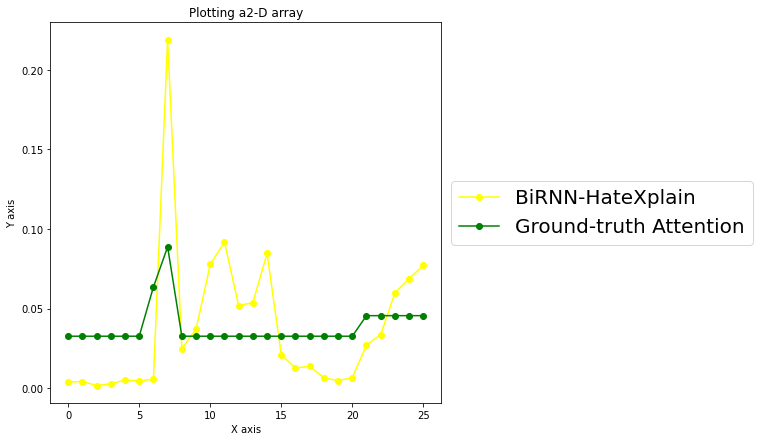
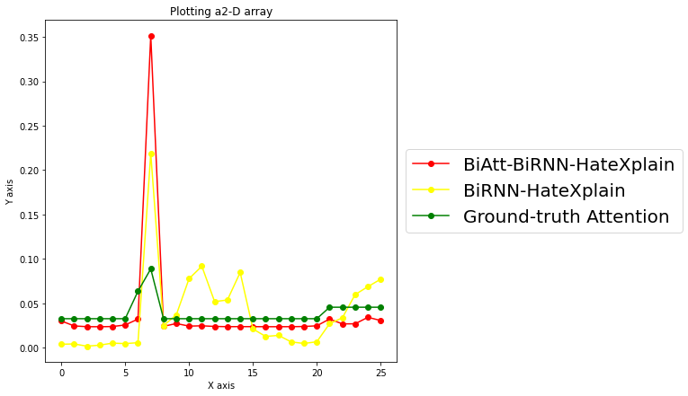

# BiAtt-HateXplain
This algorithm is derived from the BiRNN-HateXplain algorithm, and this project is based on the HateXplain project https://github.com/hate-alert/HateXplain/tree/master (Associated article : https://arxiv.org/pdf/2012.10289)
The results of our studies can be found in the ```models_and_results/BiAtt_BiRNN_max_2``` folder.

File ```example_hatexplain_with_BiRNN-HateXplain_vs_BiAtt_BiRNN-HateXplain.ipynb``` contains examples of comparison between ground truth attention, attention predicted by BiRNN-HateXplain and that predicted by BiAtt-BiRNN-HateXplain.

To train a proposed model use the file ```Example_HateExplain.ipynb```

## Objective
The objective of this project is to improve the results of the BiRNN-HateXplain and BERT-HateXplain algorithms in terms of detection performance, unintentional bias, and explainability.

## Problem with current approaches
In current algorithms such as BiRNN-HateXplain, we observe a large variation in the estimated attention when it should be constant.  


## Proposal
Our hypothesis is that considering the sequential aspect of input data in HateXplain models could resolve the variability of attention and improve explainability. And then, it can also improve classification performance and unintentional biases related to communities indexed in hate speech  because it uses multi-task learning(classification and explainability tasks).

## Results
The results show that the proposed approach improves explainability, prediction performance, and metrics that measure unintentional biases of the model. We also observed that the attention estimated by the proposed approach estimates constant attention when it should be.  


## Installation
It is recommended to use a tool like ```conda``` to create a virtual environment and facilitate conflict management.
